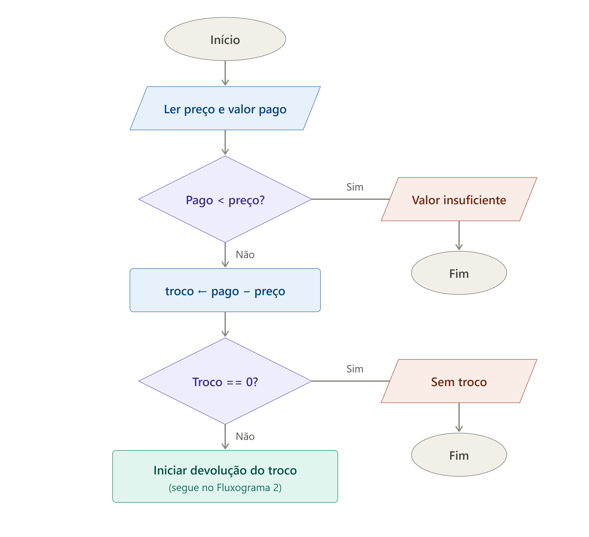
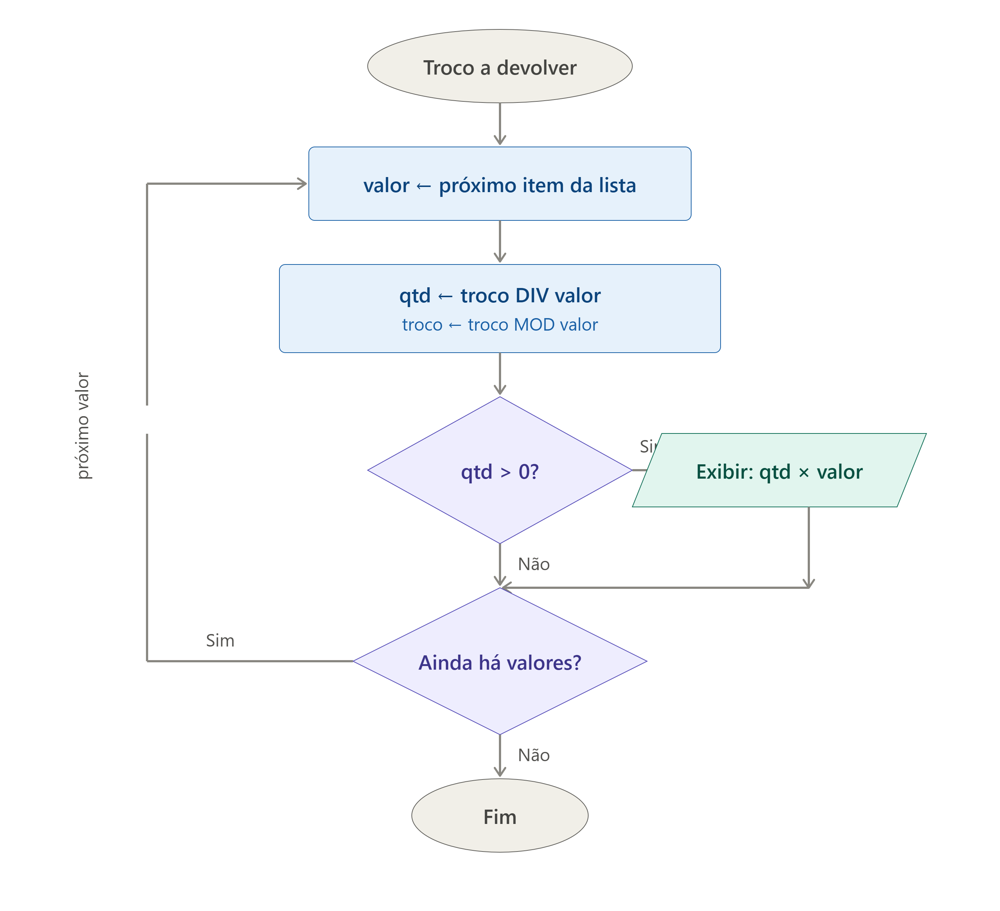

Parte 1 — Descrição narrativa

A máquina de troco funciona da seguinte forma: primeiro, ela pergunta ao cliente o preço do produto escolhido e o valor que ele pagou, e guarda os dois números em centavos, para evitar erros de arredondamento com casas decimais.

Em seguida, a máquina compara o valor pago com o preço do produto. Se o valor pago for menor que o preço, ela exibe a mensagem "Valor insuficiente" e o processo é encerrado imediatamente, sem calcular nada mais — o cliente precisa inserir mais dinheiro em uma nova tentativa.

Se o valor pago for suficiente, a máquina calcula a diferença entre o valor pago e o preço, chamando esse resultado de troco. Caso o troco seja exatamente zero, ela exibe a mensagem "Sem troco" e encerra o processo, pois não há nada a devolver.

Quando o troco é maior que zero, a máquina precisa decidir quais cédulas e moedas entregar, usando a menor quantidade possível de peças. Para isso, ela possui uma lista de valores disponíveis, ordenada do maior para o menor: R$ 100, R$ 50, R$ 20, R$ 10, R$ 5, R$ 2, R$ 1, R$ 0,50, R$ 0,25, R$ 0,10, R$ 0,05 e R$ 0,01. A máquina percorre essa lista, um valor de cada vez, sempre começando pelo maior. Para cada valor da lista, ela calcula quantas vezes esse valor cabe inteiramente dentro do troco que ainda falta devolver (usando divisão inteira) — esse número é a quantidade de cédulas ou moedas daquele valor que será entregue. Em seguida, ela subtrai do troco restante o total já devolvido com aquele valor (o resto da divisão) e passa para o próximo valor da lista, repetindo o mesmo raciocínio.

Esse processo se repete até que a máquina tenha passado por todos os valores da lista, do maior ao menor. Ao final de cada passagem em que a quantidade calculada for maior que zero, a máquina exibe na tela quantas cédulas ou moedas daquele valor serão devolvidas (por exemplo, "1 × R$ 1,00"). Quando a lista de valores acaba, o troco restante já deve ser zero, e o processo é encerrado, pois todas as cédulas e moedas necessárias já foram informadas ao cliente.

Parte 2 — Fluxograma

O Fluxograma 1 trata da entrada de dados e das duas primeiras decisões. Quando sobra troco a devolver, o processo segue para o loop que percorre as cédulas e moedas:

Parte 3 — Pseudocódigo

def maquina_de_troco(preco: float, pago: float):
"""
Calcula o troco de uma transação, devolvendo o menor número de cédulas e moedas.

Args:
    preco (float): O preço do produto em reais.
    pago (float): O valor pago pelo cliente em reais.

Returns:
    None: Imprime as mensagens e o detalhe do troco.
"""
# Converte os valores para centavos para evitar problemas de ponto flutuante
preco_centavos = int(preco * 100)
pago_centavos = int(pago * 100)

if pago_centavos < preco_centavos:
    print("Valor insuficiente")
    return

troco_centavos = pago_centavos - preco_centavos

if troco_centavos == 0:
    print("Sem troco")
    return

print(f"Troco: R$ {troco_centavos / 100:.2f}")
print("Detalhes do troco:")

# Cédulas e moedas disponíveis em centavos
# 10000 = R$100, 5000 = R$50, ..., 1 = R$0.01
valores = [10000, 5000, 2000, 1000, 500, 200, 100, 50, 25, 10, 5, 1]

# Mapeamento para exibir os valores em Reais formatados
nomes_valores = {
    10000: "R$ 100,00", 5000: "R$ 50,00", 2000: "R$ 20,00",
    1000: "R$ 10,00", 500: "R$ 5,00", 200: "R$ 2,00",
    100: "R$ 1,00", 50: "R$ 0,50", 25: "R$ 0,25",
    10: "R$ 0,10", 5: "R$ 0,05", 1: "R$ 0,01"
}

for valor in valores:
    qtd = troco_centavos // valor
    if qtd > 0:
        print(f"{qtd} x {nomes_valores[valor]}")
        troco_centavos %= valor
Exemplos de uso:
maquina_de_troco(10.50, 10.00) # Valor insuficiente
maquina_de_troco(15.00, 15.00) # Sem troco
maquina_de_troco(12.37, 20.00) # Troco com várias cédulas e moedas
maquina_de_troco(0.01, 100.00) # Troco grande
